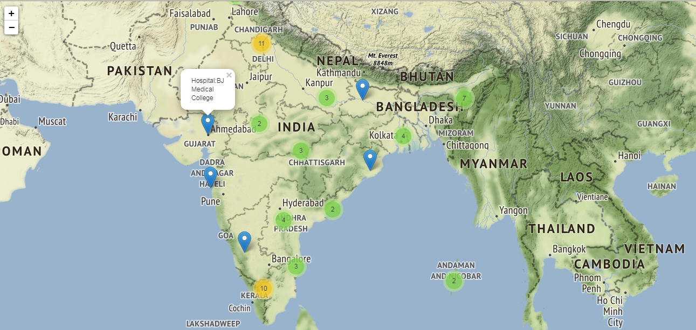

# HackJaipur_Project

</align>

 
 
This repo is created to develop our whatsapp bot for COVID19 Tracking system 
Nowadays,Covid19 cases details are spreading more from unauthentic sources to users,Inorder to avoid such issue,to create awareness about covid virus,to help users to ensure safety to avoid being prone to covid attack we built a whatsapp bot which updates about covid cases in india to users via whatsapp message.User can visit Ministry of health department of india for any more detailed news needed 
which gives the live tracking covid 19 in India. 

<B>🧰 Requirements 
<ul>
  <li>Flask a python framework</li>
  <li>python</li>
  <li>Twillo account</li>
  <li>virtual environment</li>
  <li>working whatsup account</li>
  <li>Voila library</li>
  <li>JupyterHub</li>
</ul>

<B> 📹 watch it live 
    
<B>©️ Clone the repo 
  https://github.com/deepakkapse/HackJaipur_Project.git   

     
=======

This Repo is created to convert jupyter notebook as a dashboard using the <b>Binder platform</B> 
The Binder Project is an open community that makes it possible to create sharable, interactive, reproducible environments. 

 image:: https://mybinder.org/badge_logo.svg 
 target: https://mybinder.org/v2/gh/Adityanagraj/viola/master?urlpath=voila%2Frender%2Fcoronahospitalsoutput.ipynb

